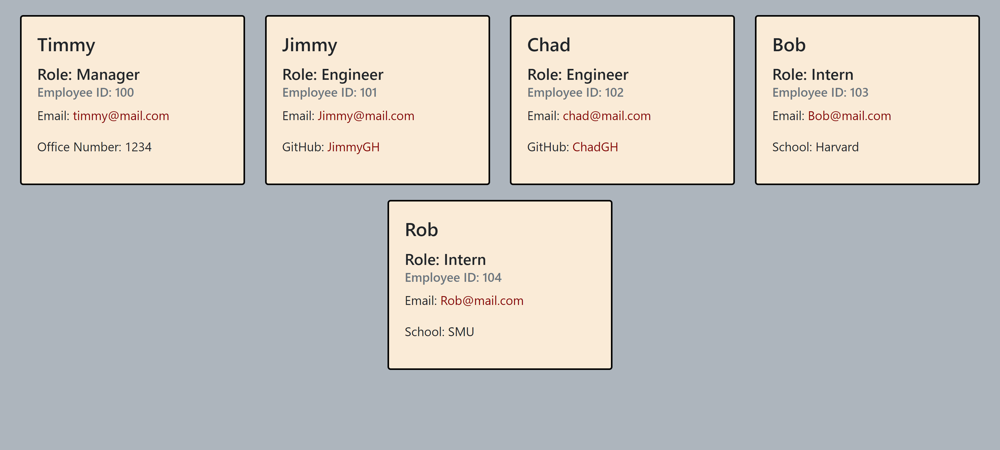

# team-profile-generator

## Description
This assignment's goal was to create a program that allows a user (manager) to add data about themselves and their team members. With this data, an HTML file would be created so all their data is added to a webpage.

```
- The manager is initally prompted to add their name, employee ID, email, and office number.
- Once the manage has added their information, they have a choice of adding a team member or finishing their team's composition.
    - If the manager decides to add a team member, they can choose between an engineer or an intern. If an engineer is chosen, the manager is prompted to add the engineer's name, ID, email and GitHub username. If an intern is chosen, the manager is prompted to add the intern's name, ID, email, and school's name.
    - If the manager chooses to finish building their team, the prompt function.
- Once the prompt function ends, an HTML file is created with the information the manager inputted.
- On the manager's card, their name, ID, email and office number appears. The engineer's card has their name, ID, email and GitHub username that, when clicked, send you to their GitHub profile. The intern's card displays their name, ID, email and their school's name. Any of the emails can be clicked and the user is then able to send an email to the chosen email.

```

## Installation Instructions
There are only two things that need to be installed:
1. jest (npm install --dev jest)
2. inquirer (npm install inquirer)

## Usage
The use of this program is for a manager to simply input data on their team members and have that data added to an HTML file automatically instead of the manager creating an entire webpage manually.

## Generated HTML


## License
This project is licensed under MIT License: A short and simple permissive license with conditions only requiring preservation of copyright and license notices. Licensed works, modifications, and larger works may be distributed under different terms and without source code.

## Contributors
Kelly Jefferies <br>
Daniel Norred

## Links
- [Project Repository](https://github.com/eugene125/team-profile-generator)
- [Project Walkthrough Video](https://drive.google.com/file/d/1kO4tp_n91TFDQT7wTmVwrFj1Rx3PIqyH/view?usp=sharing)